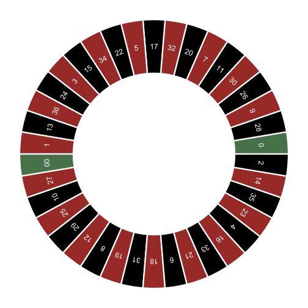
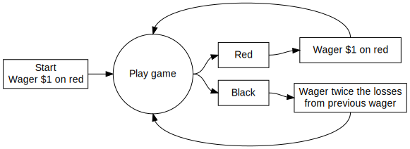

Roulette
========



A roulette table composed of 38 (or 37) evenly sized pockets on a wheel.
The pockets are colored red, black, or green. The pockets are also
numbered. Roulette is a game of chance in which a pocket is randomly
selected. Gamblers may wager on several aspects of the outcome. For
example, one may place a wager that the randomly selected pocket will be
red or odd numbered or will be a specific number.

For this assignment, all one needs to know is that there are 38 pockets
of which 2 are green, 18 are red, and 18 are black. The payout for a bet
on black (or red) is $1 for each $1 wagered. This means that if a
gambler bets $1 on black and the randomly selected pocket is black, then
the gambler will get the original $1 wager and an additional $1 as
winnings.

Roulette strategies
-------------------

There are several *strategies* for playing roulette. (*Strategies* is in
italics because the house always wins, in the long run.) Consider one
such strategy:



This is a classic roulette strategy called the “Martingale” strategy.
Consider how the strategy playes out for a single sequence of spins
{Black, Black, Red}.

| Play | Wager | Outcome | Earnings |
|:----:|:-----:|:-------:|:--------:|
|   1  |   1   |  Black  |    -1    |
|   2  |   2   |  Black  |    -3    |
|   3  |   4   |   Red   |    +1    |

Now consider a sequence {Black, Black, Black, Red}.

| Play | Wager | Outcome | Earnings |
|:----:|:-----:|:-------:|:--------:|
|   1  |   1   |  Black  |    -1    |
|   2  |   2   |  Black  |    -3    |
|   3  |   4   |  Black  |    -7    |
|   4  |   8   |   Red   |    +1    |

The Martingale strategy appears to always end in positive earnings,
regardless of how unlucky a string of spins may be. Is the strategy
actually profitable?

Assignment
----------

In this assignment, you will write a blog post to explain how you used
computer simulation to understand the operating characteristics of the
above strategy.

-   The audience of your blog post is a sharp college freshman with
    little to no background in data science.

-   You should explain how you used computer simulation to calculate the
    average earnings of a gambler that uses this strategy. As part of
    the explanation, provide a figure (or a series of figures) that show
    how the gamblers earnings (or losses) evolve over a series of wagers
    at the roulette wheel. (The x-axis will be the wager number (or play
    number), the y-axis will be earnings.) The code below provides all
    the functions you’ll need to calculate average earnings.

-   Show your audience how changing a parameter of the simulation (see
    table below) does or does not have an impact on average earnings. A
    figure would be helpful.

-   See the stopping rule below. Explain to your audience how you used
    computer simulation to estimate the average number of plays before
    stopping. The code below will need to be modified to calculate this
    quantity.

-   Be sure to explain the limitations of the simulation; identify
    simplifications or other sources of uncertainty.

### Submission instructions

1.  Create a .qmd (or .rmd) script file which generates an .html or .pdf report with the name `roulette-simulation`
1.  Submit your reproducible report on **Canvas**.  If you generated an .html report, you can "print to pdf" to generate a .pdf for submission.
1.  Be prepared to share your blog post with the class when the
    deliverable is due
1.  The deliverable should be your own work. You may **discuss**
    concepts with classmates, but you may **not share** code or text.

Additional assumptions for the simulation.
------------------------------------------

### Stopping rule

A player will use the above strategy and play until

1.  the player has **`winning_threshold`** dollars
2.  the player goes bankrupt
3.  the player completes **`max_games`** wagers (or plays)

### Budget

The player starts with **`starting_budget`** dollars. The player cannot wager more money
than he/she has.

### Maximum wager

Some casinos have a maximum bet. Call this parameter **`max_wager`**. If the
strategy directs the player to wager more than `max_wager` dollars, then the
player will only wager `max_wager` dollars.

Summary of parameters
---------------------

| Parameter | Description                     |             Starting value             |
|:---------:|:--------------------------------|:--------------------------------------:|
|   **`starting_budget`**   | Starting budget                 |                  $200                  |
|   **`winning_threshold`**   | Winnings threshold for stopping | $300 (Starting budget + $100 winnings) |
|   **`max_games`**   | Time threshold for stopping     |               1000 plays               |
|   **`max_wager`**   | Casino’s maximum wager          |                  $100                  |


A solution [(Video solution)](https://youtu.be/Bz7c24aAObg)
----------

``` r
single_spin <- function(){
  possible_outcomes <- c(rep("red",18), rep("black",18), rep("green",2))
  sample(possible_outcomes, 1)
}

martingale_wager <- function(
    previous_wager
  , previous_outcome
  , max_wager
  , current_budget
){
  if(previous_outcome == "red") return(1)
  min(2*previous_wager, max_wager, current_budget)
}

one_play <- function(previous_ledger_entry, max_wager){
  # Create a copy of the input object that will become the output object
  out <- previous_ledger_entry
  out[1, "game_index"] <- previous_ledger_entry[1, "game_index"] + 1
  out[1, "starting_budget"] <- previous_ledger_entry[1, "ending_budget"]
  out[1, "wager"] <- martingale_wager(
    previous_wager = previous_ledger_entry[1, "wager"]
    , previous_outcome = previous_ledger_entry[1, "outcome"]
    , max_wager = max_wager
    , current_budget = out[1, "starting_budget"]
  )
  out[1, "outcome"] <- single_spin()
  out[1, "ending_budget"] <- out[1, "starting_budget"] + 
    ifelse(out[1, "outcome"] == "red", +1, -1)*out[1, "wager"]
  return(out)
}

one_series <- function(
  max_games, starting_budget, winning_threshold, max_wager
){
  # Initialize ledger
  ledger <- data.frame(
      game_index = 0:max_games
    , starting_budget = NA_integer_
    , wager = NA_integer_
    , outcome = NA_character_
    , ending_budget = NA_integer_
  )
  ledger[1, "wager"] <- 1
  ledger[1, "outcome"] <- "red"
  ledger[1, "ending_budget"] <- starting_budget
  for(i in 2:nrow(ledger)){
    #browser()
    ledger[i,] <- one_play(ledger[i-1,], max_wager)
    if(stopping_rule(ledger[i,], winning_threshold)) break
  }
  # Return non-empty portion of ledger
  ledger[2:i, ]
}

stopping_rule <- function(
  ledger_entry
  , winning_threshold
){
  ending_budget <- ledger_entry[1, "ending_budget"]
  if(ending_budget <= 0) return(TRUE)
  if(ending_budget >= winning_threshold) return(TRUE)
  FALSE
}

profit <- function(ledger){
  n <- nrow(ledger)
  profit <- ledger[n, "ending_budget"] - ledger[1, "starting_budget"]
  return(profit)
}

require(magrittr)

svg(filename = "loser.svg", width=16, height =9)
par(cex.axis=2, cex.lab = 2, mar = c(8,8,2,2), bg = rgb(222, 235, 247, max = 255))
set.seed(1)
ledger <- one_series(200,200,300,500)
plot(ledger[,c(1,5)], type = "l", lwd = 5, xlab = "Game Index", ylab = "Budget")
dev.off()

svg(filename = "winner.svg", width=16, height =9)
par(cex.axis=2, cex.lab = 2, mar = c(8,8,2,2), bg = rgb(222, 235, 247, max = 255))
set.seed(2)
l2 <- one_series(200,200,300,500)
plot(l2[,c(1,5)], type = "l", lwd = 5, xlab = "Game Index", ylab = "Budget")
dev.off()
```


(Optional) An alternative, computationally faster solution
----------

``` r
martingale_wager <- function(
    previous_wager
  , previous_outcome
  , max_wager
  , current_budget
){
  if(previous_outcome == 1) return(1)
  min(2*previous_wager, max_wager, current_budget)
}


profit <- function(l1) l1[nrow(l1),4] - l1[1,1]

one_series <- function(ng, sb, wt, mw){
# ng = max number of spins
# sb = starting budget
# wt = ending budget (starting budget + winning threshold)
# mw = max wager
  l1 <- matrix(NA_integer_,nrow=ng,ncol=4)
  l1[,3] <- rbinom(ng,1,18/38)
  l1[1,1] <- sb
  l1[1,2] <- 1
  l1[1,4] <- ifelse(l1[1,3]==1, sb + 1, sb - 1)

  for(i in 2:ng){
    w <- martingale_wager(l1[i-1,2], l1[i-1,3], mw, l1[i-1,4])
    e <- ifelse(l1[i,3]==1, l1[i-1,4] + w, l1[i-1,4] - w)
    s <- e <= 0 | e >= wt
    l1[i,c(1,2,4)] <- c(l1[i-1,4], w, e)
    if(s) break
  }
  l1[1:i,]
}

one_series(100,200,300,100)[,4] |> plot(type = "l", xlim = c(0,100), ylim = c(0,300))
```
