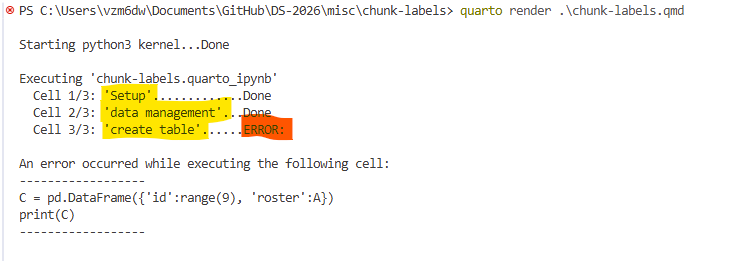

# Understanding chunk labels


Chunk labels are for **debugging** and **organizing** code. They do **NOT** appear in the
rendered document. For example, consider the `.qmd` file below.

```` {verbatim}
---
title: "Understanding chunk labels"
format: markdown
---

```{python}
#| label: Setup
import numpy as np
import pandas as pd
```


```{python}
#| label: data management
A = np.random.choice(range(1,365),10)
B = max(A)
```

```{python}
#| label: create table
C = pd.DataFrame({'id':range(9), 'roster':A})
print(C)
```
````

If we where to render the document, it would generate an error:



Note that as Quarto renders the document, it indicates its progress by
writing to the log. If computation gets hung up, you’ll be able to see
which chunk is causing the issue. If there is an error, the log will
indicate in which chunk the error occured. In this case, it flagged the
`create table` chunk.

After investigation, we see that we made an “off-by-one” error. After
fixing it, the document will render.

``` python
import numpy as np
import pandas as pd
```

``` python
A = np.random.choice(range(1,365),10)
B = max(A)
```

``` python
C = pd.DataFrame({'id':range(10), 'roster':A})
print(C)
```

       id  roster
    0   0     144
    1   1     285
    2   2     130
    3   3     195
    4   4     362
    5   5      43
    6   6     330
    7   7     257
    8   8     286
    9   9     145
